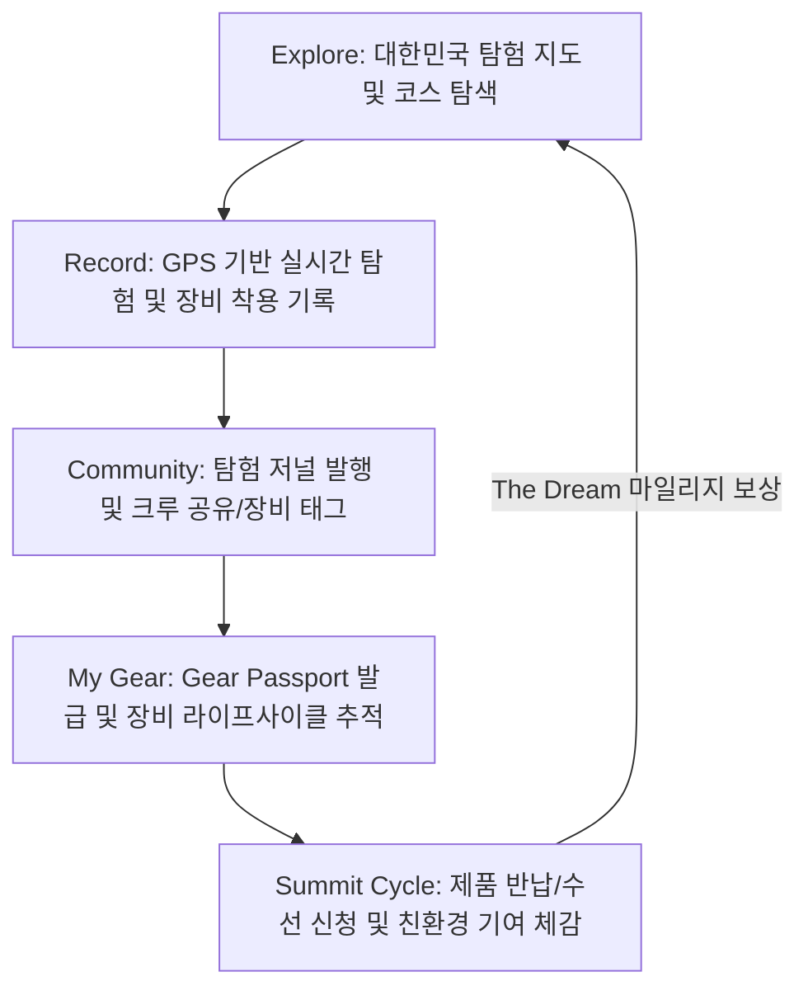

# TNF SUMMIT CREW - Product Requirements Document (PRD)

---

## 1. Product Overview (제품 개요)
*   **제품명**: TNF SUMMIT CREW (더 노스페이스 서밋 크루)
*   **제품 비전**: 
    > **"TNF SUMMIT CREW는 The North Face Summit Series 사용자를 위한 디지털 익스페디션(Expedition) 플랫폼이다."**
    
    본 제품은 단순한 아웃도어 활동 기록 앱을 넘어, 사용자가 **탐험을 계획(Explore)하고, 기록(Record)하며, 다른 탐험가들과 공유(Share)하고, 보유 장비를 관리(My Gear)하며, 제품 순환 생태계(Summit Cycle)에 참여**할 수 있도록 돕는 프리미엄 브랜드 경험 플랫폼입니다.
    
    구매 이후에도 사용자와 제품이 함께 성장하는 여정을 제공함으로써 **Explore → Record → Share → Gear → Cycle**의 선순환 구조를 가진 지속가능한 탐험 생태계를 구축하고자 합니다.

---

## 2. Background & Problem Definition (배경 및 문제 정의)
*   **기존 아웃도어 서비스의 한계**:
    *   Strava, Garmin Connect, AllTrails, Suunto 등 대부분의 앱은 GPS 경로 추적 및 운동 기록(시간, 속도, 고도 등)의 정량적 데이터 측정에 치우쳐 있습니다.
    *   이러한 서비스들은 사용자의 '활동'만을 기록할 뿐, 그들이 착용한 '브랜드와 제품의 실제 경험'을 연결해 주지 못하고 있습니다.
*   **노스페이스 Summit Series의 브랜드 기회**:
    *   Summit Series는 극지방 및 고산 지대 등 최악의 환경을 극복하기 위해 설계된 최고 수준의 익스페디션 장비 라인업이지만, 구매 이후 고객과 소통할 디지털 브랜드 접점이 부족했습니다.
    *   **TNF SUMMIT CREW**는 **[제품 구매 ➔ 탐험 ➔ 커뮤니티 공유 ➔ 장비 수명 관리 ➔ 제품 반납 및 순환]**을 매끄럽게 연결함으로써 프리미엄 라인에 걸맞은 차별화된 디지털 브랜드 가치를 제안합니다.

---

## 3. Product Goals (제품 목표)
### 3.1. Business Goals (비즈니스 목표)
1.  **브랜드 충성도 극대화**: Summit Series 고객에게 특화된 고유의 디지털 커뮤니티와 프리미엄 브랜드 경험을 제공합니다.
2.  **기존 멤버십 시너지**: 노스페이스 공식 멤버십인 'The Dream Membership' 마일리지 시스템과 연동하여 오프라인/온라인 구매로의 유입을 유도합니다.
3.  **지속가능한 순환 모델 활성화**: 중고 장비 보상 반납, 수선(Repair) 및 재활용(Recycle) 프로세스를 단순화하여 의류 순환 및 친환경 브랜드 이미지를 강화합니다.
4.  **LTV(고객 평생 가치) 증대**: 장비 이력 관리와 커뮤니티 활성화를 통해 자연스러운 재구매 및 장비 업그레이드를 유도합니다.

### 3.2. User Goals (사용자 목표)
1.  **의미 있는 탐험 기록**: 자신의 탐험 경로와 데이터를 Summit Series 장비 정보와 연계하여 나만의 '익스페디션 저널'로 자산화합니다.
2.  **장비 생애주기 관리**: 각 장비의 누적 사용 거리, 동반한 탐험 이력을 'Gear Passport'를 통해 투명하게 추적하고 관리합니다.
3.  **경험의 공유와 존중**: 험난한 탐험을 완수한 크루들과 깊이 있는 루트 정보 및 장비 후기를 공유하며 상호 존중(Respect)합니다.
4.  **환경적 기여 체감**: 제품 반납 및 순환 프로그램 참여를 통해 개인의 친환경 기여도(My Impact)를 직관적인 수치로 확인하고 보상을 얻습니다.

---

## 4. Target User & Persona (타깃 유저 및 페르소나)
*   **주요 사용자층**: 20~40대 노스페이스 Summit Series 구매자 및 잠재 고객. 등산, 트레일러닝, 백패킹, 패스트패킹, 워터 익스페디션 등 고기능성 아웃도어 활동을 진정성 있게 즐기는 유저.

### 페르소나: Bora (27)
| 항목 | 상세 정보 |
| :--- | :--- |
| **인적 사항** | 27세, 여성, 직장인, 아웃도어 애호가 |
| **성향** | 주말마다 등산과 트레일러닝을 적극적으로 즐김. 고기능성 Summit Series 장비를 선호하며, 한번 구매한 장비를 오랫동안 아끼고 관리하여 사용하는 것을 중요하게 생각함. |
| **이용 서비스** | Strava, AllTrails |
| **핵심 니즈** | "내가 아끼는 장비와 함께한 탐험 경로와 거리를 기록으로 남기고 싶다. 수선이 필요할 땐 투명하게 맡기고, 수명이 다한 장비는 친환경적으로 순환시켜 내 생태 발자국(My Impact)을 체감하고 싶다." |

---

## 5. Core Experience Flow (핵심 경험 흐름)
사용자는 앱 내에서 다음 단계를 순환하며 지속 가능한 아웃도어 라이프를 경험합니다.

---

## 6. Navigation & Information Architecture (정보 구조)
앱은 하단 탭 바 기반의 내비게이션을 기본으로 하며, 중앙의 '탐험 시작' 버튼을 강조된 FAB 구조로 배치합니다.

*   **Bottom Navigation**:
    1.  **Home**: 개인 대시보드 (날씨, 챌린지, 최근 기어 현황 및 누적 마일리지 요약)
    2.  **Explore**: 탐험 루트 탐색 (GPX 경로 다운로드, 추천 코스, 매칭 기어 및 후기)
    3.  **START Expedition (Primary FAB)**: 탐험 기록 시작/정지/종료 (가상 GPS 실시간 시뮬레이션 인터랙션)
    4.  **Community**: 크루들의 실시간 피드 및 챌린지 인증 공간
    5.  **My (My Gear & Impact)**: 보유 장비 현황(Gear Passport), 타임라인, 환경 임팩트 리포트

---

## 7. Main Features (상세 기능 정의 - MVP 스코프 중심)

### 7.1. Home (개인 대시보드)
*   **오늘의 탐험 정보**: 실시간 날씨 요약(데모 데이터) 및 맞춤형 추천 코스 제안.
*   **오늘의 Challenge**: 유저 참여 유도를 위한 일일 미션 정보 표시 (예: "고도 500m 누적 오르기").
*   **The Dream Mileage**: 현재 보유한 노스페이스 멤버십 마일리지 잔액 및 적립 현황 시각화.
*   **최근 활동 요약**: 직전 완료한 Expedition 이력 및 최근 사용한 Gear의 누적 활동 거리 표시.

### 7.2. Explore (탐험 지도 및 코스)
*   **대한민국 탐험 지도**: 전국 주요 등산/트레일러닝 코스를 인터랙티브 지도로 제공.
*   **코스 상세 필터**: 난이도(초급/중급/전문가), 계절, 예상 소요 시간 필터링.
*   **GPX 다운로드**: 스마트기기나 타 앱에서 활용할 수 있는 GPX 파일 가짜 다운로드 기능 제공.
*   **추천 Summit Gear 및 크루 리뷰**: 해당 코스를 완주하는 데 최적화된 Summit Series 제품군 정보와 실제 사용자들의 착용 후기 연결.

### 7.3. Record Expedition (탐험 기록)
*   **실시간 가상 GPS 시뮬레이션**:
    *   사용자가 'START' 버튼을 누르면, 실제로 야외에서 이동하지 않더라도 화면 내부에서 시간(Timer), 누적 거리(km), 현재 속도(km/h), 획득 고도(m) 수치가 1초 주기로 실시간 상승하는 애니메이션 효과 구현.
    *   실시간 가상 궤적이 지도 위에 그려지는 연출을 포함하여 활동적이고 역동적인 시각 피드백 제공.
*   **기어 연결성**: 탐험 시작 전, 오늘 착용할 보유 Summit Gear를 선택/태그하는 프로세스 제공.
*   **Expedition Journal 자동 생성**: 
    *   탐험 종료(Hold & Stop 인터랙션) 후, 이동 경로 이미지와 핵심 통계가 자동으로 결합된 한 장의 아름다운 '저널 카드' 템플릿 생성.
    *   사용자는 사진을 추가하여 즉시 커뮤니티로 발행 가능.

### 7.4. Community (탐험 피드 및 소셜)
*   **피드 목록**: 탐험가들이 생성한 Expedition Journal이 카드 피드 형태로 정렬.
*   **Respect Expedition 버튼**: 타인의 험난한 탐험과 도전에 경의를 표하는 고유의 인터랙티브 반응 버튼 (일반적인 '좋아요'와 차별화).
*   **장비 태그(Gear Tagging)**: 피드 이미지 내에 노스페이스 장비를 태그하여 클릭 시 해당 장비의 세부 사양 정보로 연계.

### 7.5. My Gear & Gear Passport (보유 장비 및 생애주기)
*   **보유 장비 등록**: 바코드/QR 스캔(가상) 또는 카탈로그 검색을 통해 내가 구매한 Summit Series 장비 등록.
*   **Gear Passport**:
    *   장비별 고유 디지털 보증서 및 스펙 요약.
    *   상태 표시(Active: 사용 중 / Repair: 수선 중 / Recycled: 반납 완료).
*   **Gear Journey Timeline**:
    *   이 장비와 함께한 모든 Expedition 기록이 시간 순으로 나열되는 디지털 타임라인.
    *   "이 자켓은 설악산 대청봉을 포함해 총 15회, 누적 120km를 함께 탐험했습니다"와 같은 감성적인 통계 제공.

### 7.6. Summit Cycle & My Impact (제품 순환 및 친환경)
*   **간소화된 2가지 반납 신청 프로세스**:
    *   수명이 다한 장비의 반납 신청 시 다음 두 가지 방식 중 하나를 직관적으로 선택하는 간소화 화면 구성:
        1.  **온라인 택배 수거 신청**: 반납 주소 입력, 수거 희망일 지정, 가상 택배 수거 접수 완료 프로세스.
        2.  **오프라인 매장 방문 반납**: 주변 노스페이스 매장 검색/선택 후, 매장 카운터에 제시할 반납용 바코드/QR 코드 생성 프로세스.
    *   반납 처리 세부 유형 선택 연출 (Repair: 수선 후 재분배 / Reuse: 빈티지 제품화 / Recycle: 친환경 원사 추출).
*   **The Dream Mileage 보상**: 반납 완료 시 기존 멤버십 마일리지(예: 10,000 P) 즉시 적립 연출.
*   **My Impact (ESG 대시보드)**:
    *   사용자가 반납한 제품들을 기반으로 절감된 환경 비용 시각화.
    *   탄소 절감량(CO₂), 물 절약량(Water Saving), 텍스타일 폐기물 감소량(Textile Waste Reduction) 표시.
    *   **Equivalent Impact**: 직관적인 체감을 돕기 위해 "구해낸 나무 수(Trees Saved)", "자동차 운행 감소 거리(Driving Reduction)" 등으로 비주얼 환산 제공.

---

## 8. Reward & Point System (보상 시스템)
*   독자적인 가상 포인트를 발행하는 비효율성을 방지하고, 브랜드 실효성을 높이기 위해 **기존 노스페이스 멤버십인 'The Dream Membership Mileage'와 100% 통합 연동**하는 시나리오를 적용합니다.
*   **마일리지 적립 액션**:
    *   Expedition 챌린지 코스 완주
    *   Summit Cycle을 통한 제품 반납 (가장 높은 적립금 지급)
    *   커뮤니티 내 양질의 탐험기/장비 후기 작성 및 추천 획득
*   **마일리지 사용처**: 노스페이스 공식 온라인 몰 및 전국의 오프라인 직영/가맹 매장.

---

## 9. Design System & UX/UI Directions (디자인 방향성)
*   **Design Keywords**: **Premium, Minimal, Technical, Outdoor, Professional**
*   **Color Palette**:
    *   `Primary Background`: Dark Gray / Dark Slate Blue (극지방의 밤과 단단한 암반을 상징하는 깊은 어둠)
    *   `Surface / Card`: HSL 기반 반투명 백그라운드 (Glassmorphism 기법 활용, 고기능성 멤브레인 필름의 겹침을 표현)
    *   `Primary Accent`: **TNF Red** (노스페이스 오리지널 레드 - 신뢰감과 브랜드 아이덴티티)
    *   `Secondary Accent`: **Neon Green** (탐험 기록 활성화 상태, GPS 라인, ESG 달성 상태 표시에 사용)
*   **Typography**:
    *   기본 시스템 폰트는 가독성이 뛰어난 Technical Sans Serif 계열 (예: Outfit 또는 Inter 웹폰트 연동).
    *   수치 및 통계 데이터 표기 시 Bold 테크니컬 서체를 사용하여 장비의 계측기 느낌 극대화.
*   **Component Styling**:
    *   GORE-TEX 태그나 제품 라벨에서 영감을 얻은 미니멀한 테크니컬 디자인.
    *   모서리 둥글기(Border Radius)는 4px ~ 8px 사이의 컴팩트한 값을 적용하여 단단하고 날렵한 전문 장비 이미지 연출.

---

## 10. MVP Prototype Scope (데모 시연 범위)
공모전 시연용 고도화 프로토타입으로 개발하기 위해 프론트엔드 모션 및 유저 인터랙션 완성도에 집중하며, 복잡한 인프라 및 API는 하드코딩된 데모 데이터로 대체합니다.

| 분류 | MVP 구현 포함 사항 (시연 시나리오) | 제외 및 가상 연출 사항 (Mocking) |
| :--- | :--- | :--- |
| **Home & Profile** | 개인 챌린지 현황, 마일리지 누적 수치 대시보드 화면 렌더링 | 실시간 날씨 API 연동 (더미 고정 데이터 사용), 로그인/회원가입 세션 관리 |
| **Explore** | 추천 등산 코스 3종 상세 화면 전환, 관련 추천 기어 연동 UI | 실제 GPX 파일 생성 및 디바이스 다운로드 기능 |
| **Expedition Record** | **가상 GPS 실시간 시뮬레이션 (시작 -> 수치 실시간 상승 애니메이션 -> 종료 버튼 홀딩 모션 -> 저널 생성 완료 프로세스)** | 실제 스마트폰 내장 GPS 하드웨어 수신, 백그라운드 위치 추적 |
| **Community Feed** | 프리셋 피드 목록 렌더링, Respect(좋아요) 애니메이션, 내 저널 피드에 추가하기 | 실제 데이터베이스 저장 및 타인 피드 실시간 반영 |
| **My Gear** | 내 장비 목록 확인, 기어 타임라인(Timeline) 스크롤 인터랙션 | 실제 바코드/QR 물리 카메라 리딩 (카메라 프레임 내 가상 바코드 리딩 연출) |
| **Summit Cycle & ESG** | **간소화된 2종 반납 프로세스 (장비 선택 -> 온/오프라인 택배수거/매장방문 선택 -> 수거일정입력/QR코드생성 완료 -> 마일리지 적립 및 ESG 수치 업데이트)** | 오프라인 매장 포스기와의 실제 연동, 실제 택배사 API |

---

## 11. Review Items & Suggestions (개선 제안 및 검토 사항)

### 💡 기획 고도화 제안 (공모전 심사위원에게 어필할 포인트)
1.  **LNT (Leave No Trace) 챌린지 기능**: ESG를 실천하는 방법으로 쓰레기를 주우며 걷는 '플로깅(Plogging)' 챌린지나 산불 방지 챌린지 등을 'Start Expedition' 내에 선택 옵션으로 포함하여 환경 보호 기여도를 높이는 방안.
2.  **소재별 자가 진단 및 케어 케어 가이드**: 등록한 기어(예: Gore-Tex 자켓, 구스다운 파카)를 오래 입을 수 있는 세탁법이나 아웃도어 전용 세제 추천 콘텐츠를 My Gear 하단에 연동하여 장비 생애주기를 늘리는 브랜드 기여도 향상.
3.  **Expedition Journal의 SNS 템플릿 내보내기**: 완성된 Expedition 저널 이미지를 인스타그램 스토리나 피드 포맷으로 간편하게 최적화하여 다운로드할 수 있는 카드 템플릿 공유 기능.
