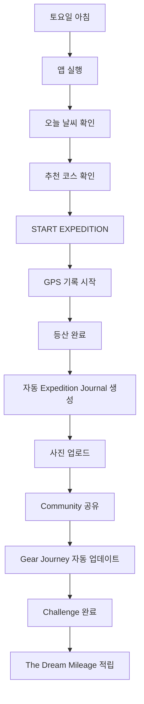
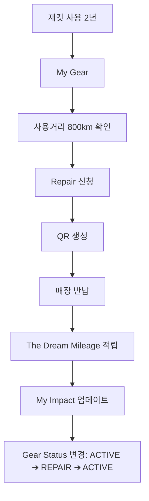
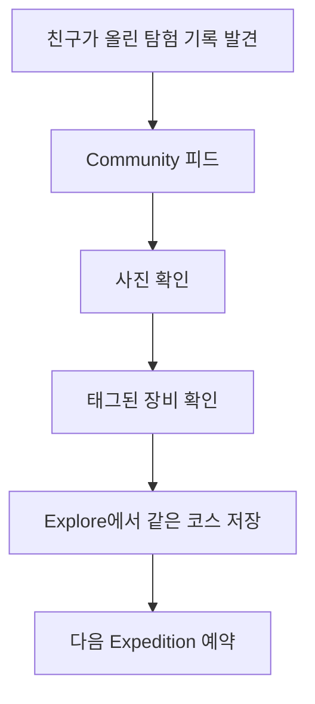
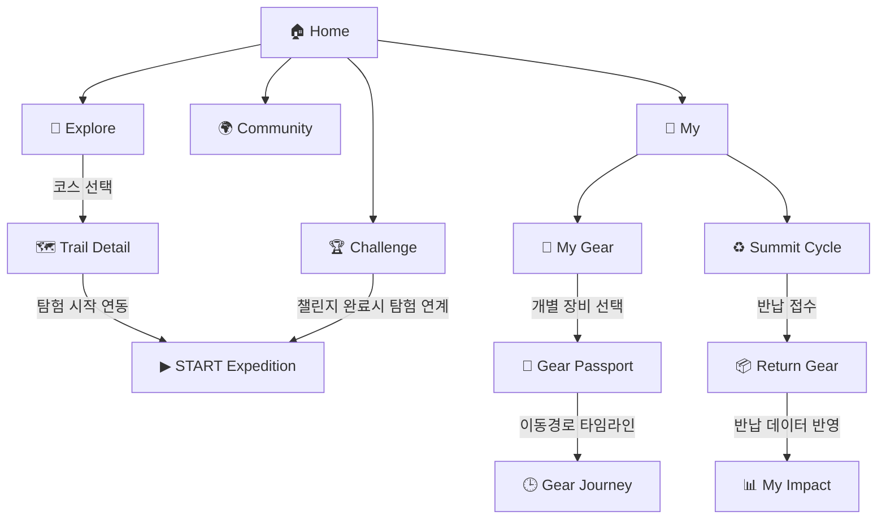

# TNF SUMMIT CREW - 서비스 기획 명세서
(User Scenario, IA, User Flow, Wireframe, Design System)

본 문서는 `TNF SUMMIT CREW` APP의 사용자 시나리오, 정보 구조(IA), 사용자 흐름(User Flow), 와이어프레임(Wireframe) 및 디자인 시스템(Design System)을 한눈에 볼 수 있도록 설계한 기획서입니다. 이 문서는 향후 개발 단계에서 화면 연결 및 UI 컴포넌트 설계를 직관적으로 이해할 수 있는 이정표 역할을 합니다.

---

## 2. User Scenario (사용자 시나리오)

### 👤 Persona: Bora (27)
*   **프로필**: Summit Series를 즐겨 입는 27세 아웃도어 애호가.
*   **라이프스타일**: 주말마다 산을 찾아 등산과 트레일러닝을 즐김.
*   **가치관**: 일회성 소비보다 고기능성 프리미엄 장비를 구매해 수선해가며 오랫동안 아끼고 사용하는 것을 중요하게 생각함.

---

### 🏃‍♀️ Scenario 1: 토요일 아침의 등산 기록 및 커뮤니티 공유
> **Bora는 주말 아침, 산행 기록과 장비 사용량 기록을 위해 앱을 켭니다.**

*   **상황 스토리**:
    토요일 아침, Bora는 등산 준비를 마치고 현관에서 `TNF SUMMIT CREW` 앱을 실행합니다. 오늘의 설악산 날씨와 온도를 확인한 뒤, 추천 코스인 '대청봉 최단 코스'의 세부 정보를 읽어봅니다. 오늘 착용하는 'Futurelight Jacket'을 선택하고 `START EXPEDITION` 버튼을 누릅니다. 
    산에 오르는 동안 화면에서는 가상 GPS 기록이 시작되어 실시간으로 거리와 고도가 기록됩니다. 정상에 도달해 등산을 완료하자 자동으로 `Expedition Journal`이 생성되고, Bora는 정상에서 찍은 사진을 추가하여 커뮤니티에 공유합니다. 
    공유가 완료되자 Bora의 'Futurelight Jacket' 누적 사용 거리가 즉시 10km 늘어나며 `Gear Journey`가 업데이트되고, 주말 챌린지 성공과 함께 노스페이스 공식 멤버십 마일리지인 `The Dream Mileage`가 적립됩니다.



---

### ♻️ Scenario 2: 2년간 함께한 재킷의 수선(Repair) 및 환경 임팩트 확인
> **Bora는 2년 동안 동고동락한 재킷의 누적 사용량과 상태를 관리하고 수선을 신청합니다.**

*   **상황 스토리**:
    Bora는 문득 옷장에 걸린 Futurelight Jacket을 보고 앱의 `My Gear` 탭을 엽니다. 이 재킷과 함께 누적 800km의 거리를 탐험했음을 확인하고, 헤진 소매 부분을 고치기 위해 `Repair` 신청을 누릅니다. 
    간편한 접수 프로세스를 거쳐 반납용 QR 코드가 화면에 생성됩니다. Bora는 주말에 근처 노스페이스 매장에 들러 점원에게 QR을 보여주고 재킷을 반납합니다. 
    반납 접수가 완료되자마자 감사의 의미로 `The Dream Mileage`가 적립되며, Bora의 자원 순환 기여를 기리는 `My Impact` 대시보드(탄소/수자원 절약 등)가 실시간 업데이트됩니다. 재킷의 상태 정보는 `ACTIVE` ➔ 수선 기간 동안 `REPAIR` ➔ 수선이 완료되어 제품을 다시 수령한 뒤 `ACTIVE`로 변경됩니다.



---

### 🤝 Scenario 3: 크루의 탐험 피드에서 영감을 얻은 다음 탐험 예약
> **Bora는 커뮤니티에서 친구의 탐험기를 발견하고 새로운 코스 탐험을 계획합니다.**

*   **상황 스토리**:
    Bora는 퇴근 후 휴식을 취하며 앱의 `Community` 피드를 둘러봅니다. 친구가 올린 멋진 등산 저널 사진을 발견하고 게시글을 클릭합니다. 친구가 착용한 의류 태그(Summit VECTIV 슈즈 등)를 눌러 실제 장비 정보를 구경한 뒤, 해당 저널 카드에 연결된 `Explore` 코스 보기 버튼을 통해 동일한 '지리산 공룡능선 코스' 상세 화면으로 이동합니다. 
    이 코스를 마음에 담아두기 위해 '코스 저장'을 누르고, 다음 주말 도전할 Expedition으로 예약을 완료합니다.



---

## 3. Information Architecture (IA)

### 📌 IA 설계 목적
*   앱의 전체 구조와 각 화면의 관계를 정의하고, "이 앱에는 어떤 메뉴가 있고, 각각 어떤 화면으로 구성되는가?"를 일목요연하게 정리합니다.
*   본 설계에서는 사용성 극대화 및 자연스러운 UX 연계를 위해 **하단 내비게이션 바(Bottom Navigation)를 5개 탭으로 구성**하며, **Summit Cycle(반납/친환경 기여)을 별도 탭이 아닌 MY 탭 내의 핵심 기능으로 종속**시킵니다.
    *   **Summit Cycle을 MY 내부에 두는 이유**:
        1. 하단 탭을 5개로 유지하여 모바일 사용성 최적화.
        2. 반납 프로세스가 사용자의 보유 장비(`My Gear`)와 가장 긴밀하게 연결되기 때문.
        3. `"내 장비 ➔ 반납 신청 ➔ ESG 기여도 체감 ➔ 멤버십 마일리지 보상 확인"`이라는 완결성 있는 하나의 사용자 경험 흐름(Journey)을 관통하기 때문.

---

### 🗂️ TNF SUMMIT CREW IA Tree

```
HOME (홈 대시보드)
├── Today's Expedition
├── Weather
├── Recommended Trail
├── Challenge
├── Recent Expedition
└── The Dream Mileage

EXPLORE (탐험 코스 탐색)
├── Map
├── Search
├── Categories
│      ├── Hiking
│      ├── Trail Running
│      ├── Fastpacking
│      ├── Water Expedition
│      └── Backpacking
├── Filters
│      ├── Difficulty
│      ├── Season
│      ├── Duration
│      └── Elevation
├── Trail Detail
│      ├── Photos
│      ├── GPX Download
│      ├── Reviews
│      └── Recommended Gear
└── Saved Trails

START EXPEDITION (가상 GPS 기록 - Center FAB)
├── GPS Tracking
├── Live Route
├── Distance
├── Time
├── Elevation
├── Speed
├── Pause
├── Finish
└── Expedition Journal

COMMUNITY (소셜 피드 및 소통)
├── Expedition Feed
├── Story Detail
├── Photos
├── Gear Tags
├── Respect Expedition
├── Comments
└── Challenges

MY (마이 페이지)
├── Profile
├── Expedition History
├── My Gear
│      ├── Gear Detail
│      ├── Gear Passport
│      ├── Gear Journey
│      ├── Repair Request
│      ├── Return Gear
│      └── Status (ACTIVE · REPAIR · RECYCLED)
├── Summit Cycle
│      ├── QR Return
│      ├── Return History
│      ├── My Impact
│      └── The Dream Mileage
└── Settings
```

---

### 🎯 IA 단계에서 결정된 주요 정책
1.  **하단 네비게이션 구조**: `🏠 Home` | `🧭 Explore` | `▶ Start Expedition (Center FAB)` | `🌍 Community` | `👤 My`
2.  **화면 위계 정리**: 
    *   코스 상세(`Trail Detail`)와 기어 상세(`Gear Detail`)는 각각 독립적인 상세 페이지로 열려 이탈 및 복귀가 쉽도록 구성합니다.
    *   `Summit Cycle`은 마이페이지(`MY`) 내부에서 실행되는 핵심 서브 모듈로 설계하여 장비 보증서 관리 흐름과 결합합니다.
3.  **상태값 전이**: My Gear 안의 모든 장비는 수명 주기에 따라 [ACTIVE], [REPAIR], [RECYCLED] 중 하나의 고유 상태를 가집니다.

---

## 4. User Flow (화면 이동 흐름)

### 📌 User Flow 목적
사용자가 특정 목표를 달성하기 위해 거치게 되는 화면과 행동 경로를 정의합니다. 본 제품은 다양한 유기적 기능이 포함되어 있으므로, 전체 단일 흐름 외에 **8가지 핵심 기능별 시나리오 플로우**와 **전체 화면 관계 플로우**로 구분하여 정의합니다.

---

### 🗺️ 핵심 기능별 8대 User Flow

#### 🏃‍♂️ Flow 1. Expedition Recording (메인 탐험 기록 흐름)
```
[App Launch]
     │
     ▼
  [Home]
     │
[START EXPEDITION] (Center FAB 클릭)
     │
     ▼
[Expedition Setup] (착용 장비 선택 및 코스 확인)
     │
     ▼
[GPS Recording] (실시간 가상 GPS 기록 애니메이션 시작)
     │
[Pause / Resume] (일시정지 및 다시 시작 토글)
     │
  [Finish] (STOP 버튼 롱프레스 터치)
     │
     ▼
[Expedition Summary] (탐험 기록 통계 요약 팝업)
     │
     ▼
[Expedition Journal 자동 생성] (저널 카드 커스텀 및 사진 등록)
     │
     ▼
[Share to Community] (커뮤니티 공유 발행 완료)
     │
     ▼
[Gear Journey Update] (착용한 장비의 누적 주행거리 자동 증가)
     │
     ▼
[Challenge Progress Update] (진행 중인 챌린지 달성률 즉시 반영)
     │
     ▼
[Back to Home] (홈 화면 복귀)
```

#### 🧭 Flow 2. Explore (코스 탐색 및 예약 흐름)
```
  [Home] ➔ [Explore] ➔ [Search Trail] ➔ [Filter] ➔ [Trail Detail] ➔ [GPX Download] ➔ [Save Trail] ➔ [START EXPEDITION]
```

#### 🌍 Flow 3. Community (소셜 피드 및 장비 태그 연동 흐름)
```
[Community] ➔ [Feed] ➔ [Story Detail] ➔ [Respect Expedition (리액션)] ➔ [Comment] ➔ [View Tagged Gear] ➔ [Open Trail Detail]
```

#### 🎒 Flow 4. My Gear (장비 라이프사이클 이력 관리 흐름)
```
  [My] ➔ [My Gear] ➔ [Select Gear] ➔ [Gear Detail] ➔ [Gear Passport / Gear Journey / Repair / Return / Status 확인]
```

#### ♻️ Flow 5. Summit Cycle (제품 반납 및 마일리지 보상 흐름)
```
[My Gear] ➔ [Return Gear] ➔ [Return Guide] ➔ [Generate QR (오프라인) / Address Input (온라인)] ➔ [Store Return / Delivery Completed] ➔ [Mileage Earned] ➔ [My Impact Updated] ➔ [Return History]
```

#### 🏆 Flow 6. Challenge (친환경 & 탐험 미션 수행 흐름)
```
  [Home] ➔ [Challenge] ➔ [View Challenge Detail] ➔ [Start Expedition] ➔ [Complete] ➔ [Digital Badge 획득] ➔ [The Dream Mileage 적립]
```

#### 🎫 Flow 7. Gear Passport (디지털 보증서 및 스탬프 흐름)
```
[My Gear] ➔ [Gear Passport] ➔ [Passport ID 확인] ➔ [Expedition Stamp (완주 인증 스탬프 아카이빙)] ➔ [Journey Timeline] ➔ [Current Status 확인]
```

#### 📊 Flow 8. My Impact (ESG 탄소 및 수자원 지표 대시보드 흐름)
```
  [My] ➔ [My Impact] ➔ [CO₂ Saved / Water Saved / Textile Saved 확인] ➔ [Equivalent Impact (나무 그루 수 변환)] ➔ [Return History]
```

---

### 🌐 전체 Flow 관계도 (Global Connection)



---

## 5. Low-Fidelity Wireframe (화면 레이아웃 설계)

### 📌 와이어프레임 설계 목적
각 화면의 구체적인 UI 레이아웃을 정의하고, 정보의 우선순위와 버튼/인터랙션의 위치를 확정하며, 서비스 전반에 걸친 화면 일관성을 확보합니다.

### ⚠️ 와이어프레임 설계 4대 원칙
1.  **원 스크린 원 액션 (One Screen, One Primary Action)**: 한 화면에 사용자가 집중해야 할 가장 주된 핵심 행동(Primary Action)을 단 하나만 배치합니다. (예: Home ➔ START EXPEDITION)
2.  **자연스러운 정보 흐름 (Natural Information Flow)**: 사용자의 시선과 정보의 중요도가 위에서 아래로 물 흐르듯 자연스럽게 흐르도록 구성합니다.
3.  **내비게이션 일관성 (Consistent Navigation)**: 하단 탭 바(Bottom Navigation)는 모든 주요 화면에서 항상 동일한 형태와 아이콘 순서로 유지되어야 합니다.
4.  **그리드 및 일관성 (Grid & Consistency)**: 모든 컴포넌트는 동일한 여백(8pt 그리드)과 카드 테두리 곡률 구조를 일관되게 공유하며, 노스페이스 공식 홈페이지의 고딕 감성을 녹여내고 밝은 야외 시인성을 제공합니다.

---

### 📱 Screen 1. Home (홈 대시보드)
*   **주요 행동**: 중앙의 거대한 `START EXPEDITION` 버튼을 통한 빠른 등산 기록 진입.
```
──────────────────────────────────────────────────────────
☰                 THE NORTH FACE                 🔔
──────────────────────────────────────────────────────────

  Good Morning, Bora                               

  🌤️ 23°C   Bukhansan                               

━━━━━━━━━━━━━━━━━━━━━━━━━━━━━━━━━━━━━━━━━━━━━━━━━━━━━━━━━━
  [                  START EXPEDITION                  ]  <-- Primary Action Button
━━━━━━━━━━━━━━━━━━━━━━━━━━━━━━━━━━━━━━━━━━━━━━━━━━━━━━━━━━

  Today's Challenge                                
  □ 5km Trail Running (진행률 표시)

  Recommended Trail                                
  +------------------------------------------------------+
  | [🧗 북한산 우이암 코스 (중급 | 2.5h)]                 |
  +------------------------------------------------------+

  Recent Expedition                                
  +------------------------------------------------------+
  | [🏃 도봉산 트레일러닝 (5.2km | 1.2h)]                 |
  +------------------------------------------------------+

  The Dream Mileage                                
  🔥 24,300 M

──────────────────────────────────────────────────────────
  🏠       🧭           ●           🌍          👤
 Home   Explore       START      Community      My   
──────────────────────────────────────────────────────────
```

---

### 📱 Screen 2. Explore (탐험 코스 검색)
*   **주요 행동**: 지도를 통한 주변 코스 탐색 및 기어 추천 정보 확인.
```
──────────────────────────────────────────────────────────
  [ 🔍 코스, 산 이름, 혹은 장비를 검색하세요... ]   
──────────────────────────────────────────────────────────

  Category Chips                                   
  [등산 🏔️]  [트레일 🏃]  [워터 🌊]  [패스트패킹 🌲]

──────────────────────────────────────────────────────────
  [                    INTERACTIVE MAP                   ]   
──────────────────────────────────────────────────────────

  Trail Card
  +------------------------------------------------------+
  | 🏔️ 설악산 대청봉 코스 (난이도: 전문가)                |
  | 소요시간: 5.5시간 | 고도 상승: 1,200m                 |
  |                                                      |
  | 🏷️ Recommended Gear: Summit Futurelight L5           |
  +------------------------------------------------------+

──────────────────────────────────────────────────────────
  🏠       🧭           ●           🌍          👤
──────────────────────────────────────────────────────────
```

---

### 📱 Screen 3. Recording (실시간 탐험 기록)
*   **주요 행동**: 가상 GPS 경로 트래킹 시각화 및 주요 운동 수치 계측.
```
──────────────────────────────────────────────────────────
  Expedition Recording...                        [🟢 LIVE]
──────────────────────────────────────────────────────────
  [                 DYNAMIC GPS MAP AREA                 ]   
──────────────────────────────────────────────────────────

  Distance (거리)            Time (시간)
  [ 4.82 km ]              [ 01:45:23 ]
  (1초당 0.01km 카운트업)   (타이머 실시간 작동)

  Elevation (고도)           Speed (속도)
  [ 842 m ]                [ 3.4 km/h ]

━━━━━━━━━━━━━━━━━━━━━━━━━━━━━━━━━━━━━━━━━━━━━━━━━━━━━━━━━━
       [ PAUSE (일시정지) ]     [ FINISH (종료) ]    
━━━━━━━━━━━━━━━━━━━━━━━━━━━━━━━━━━━━━━━━━━━━━━━━━━━━━━━━━━
```

---

### 📱 Screen 4. Expedition Summary (탐험 기록 요약)
*   **주요 행동**: 완주 통계 확인 및 기록 보존/공유.
```
──────────────────────────────────────────────────────────
  Great Expedition! 
──────────────────────────────────────────────────────────

  [ 지도 경로 및 완주 메달 스냅샷 ]

  - Distance: 12.4 km     - Time: 3h 15m
  - Elevation: 650 m      - Weather: Clear ☀️
  
  - Gear Used: Futurelight Jacket (누적 10km 추가)

━━━━━━━━━━━━━━━━━━━━━━━━━━━━━━━━━━━━━━━━━━━━━━━━━━━━━━━━━━
  [ Create Journal (저널 작성) ]                   
  [ Share Community (피드 바로 공유) ]
  [ Done (완료 후 홈으로) ]
━━━━━━━━━━━━━━━━━━━━━━━━━━━━━━━━━━━━━━━━━━━━━━━━━━━━━━━━━━
```

---

### 📱 Screen 5. Community (소셜 탐험 피드)
*   **주요 행동**: 사진 중심의 저널 카드 리서치 및 Respect(리스펙) 리액션.
```
──────────────────────────────────────────────────────────
  SUMMIT CREW FEED                                
──────────────────────────────────────────────────────────

  +------------------------------------------------------+
  |                                                      |
  |                       [ PHOTO ]                      | <-- 사진이 가장 크고 선명하게 보이도록 배치
  |                                                      |
  +------------------------------------------------------+
  |  🏔️ Bukhansan | 📍 Baegundae (서울)                  |
  |  🏷️ Wear Gear: Futurelight Jacket L5                  | 
  |                                                      |
  |  "정상 정복 완료! 바람막이 방풍 성능 최고네요"        |
  +------------------------------------------------------+
  |  [✊ Respect Expedition]                   [💬 Comments] 
  +------------------------------------------------------+

──────────────────────────────────────────────────────────
  🏠       🧭           ●           🌍          👤
──────────────────────────────────────────────────────────
```

---

### 📱 Screen 6. My Gear (보유 장비 및 관리)
*   **주요 행동**: 개별 장비의 생애주기 관리 및 수선/반납 접수.
```
──────────────────────────────────────────────────────────
  Bora's Gear Library                            [+] 등록
──────────────────────────────────────────────────────────

  +------------------------------------------------------+
  |  Futurelight Jacket                     [🟢 ACTIVE]  | 
  |                                                      |
  |  Distance           Expedition           Wear Count  |
  |  812 km             28                   74          |
  +------------------------------------------------------+

━━━━━━━━━━━━━━━━━━━━━━━━━━━━━━━━━━━━━━━━━━━━━━━━━━━━━━━━━━
  [ Gear Passport (디지털 보증서) ]
  [ Gear Journey (타임라인 확인) ]
  [ Repair (수선 신청) ]
  [ Return Gear (장비 반납하기) ]
━━━━━━━━━━━━━━━━━━━━━━━━━━━━━━━━━━━━━━━━━━━━━━━━━━━━━━━━━━

──────────────────────────────────────────────────────────
  🏠       🧭           ●           🌍          👤
──────────────────────────────────────────────────────────
```

---

### 📱 Screen 7. Gear Passport (디지털 보증서)
*   **주요 행동**: 브랜드 고유 카드 형태의 장비 상세 스펙 및 공식 스탬프 인증.
```
┌────────────────────────────────────────────────────────┐
│  THE NORTH FACE SUMMIT SERIES [GEAR PASSPORT]          │ <-- 여권 레이아웃 적용
│                                                        │
│  Passport ID: SC-20381                                 │
│  Owner: Bora                                           │
│  Status: ACTIVE                                        │
│  Expedition: 28회                                      │
│  Distance: 812 km                                      │
│                                                        │
│  [ DIGITAL STAMPS (완주 도장 목록) ]                   │
│  +--------------+ +--------------+ +-----------------+ │
│  | [🏔️ Hallasan] | | [🏔️Seoraksan] | | [🌊Water Trail] | │
│  +--------------+ +--------------+ +-----------------+ │
└────────────────────────────────────────────────────────┘
```

---

### 📱 Screen 8. Gear Journey (장비 타임라인 히스토리)
*   **주요 행동**: 장비의 획득부터 반납, 재사용까지의 가상 이력 모니터링.
```
──────────────────────────────────────────────────────────
  GEAR JOURNEY TIMELINE
──────────────────────────────────────────────────────────

  [🟢 ACTIVE] Futurelight Jacket

      Purchased (노스페이스 공식 매장 구매)
         │
         ▼
      🏔️ Hallasan (동반 완주 | 12km)
         │
         ▼
      🏆 Trail Challenge (50km 누적 달성)
         │
         ▼
      🔧 Repair (수선 진행 - Status: REPAIR)
         │
         ▼
      🌊 Water Expedition (동반 완주 | 15km)
         │
         ▼
      ♻️ Summit Cycle (장비 반납 - Status: RECYCLED)
         │
         ▼
      👤 New Explorer (새로운 소유자와의 매칭)
```

---

### 📱 Screen 9. Summit Cycle (제품 반납 신청)
*   **주요 행동**: 오프라인 반납 QR 생성 및 온라인 접수.
```
──────────────────────────────────────────────────────────
  SUMMIT CYCLE (제품 반납)
──────────────────────────────────────────────────────────

  Return Gear: Futurelight Jacket
  [ Generate QR Code (매장 반납용) ]             
  [ Apply Delivery Pickup (택배 신청) ]          

  Return Status: [ 수거 진행 대기 중 ]

━━━━━━━━━━━━━━━━━━━━━━━━━━━━━━━━━━━━━━━━━━━━━━━━━━━━━━━━━━
  My Impact Summary (누적 환경 기여 요약)
  - CO₂ Saved: 17 kg
  - Water Saved: 340 L
  - Recovery Rate: 100%
━━━━━━━━━━━━━━━━━━━━━━━━━━━━━━━━━━━━━━━━━━━━━━━━━━━━━━━━━━

  Expected Reward: The Dream Mileage
  [ 🔥 +5,000 M 적립 예정 ]
```

---

### 📱 Screen 10. My Impact (ESG 대시보드)
*   **주요 행동**: 절감된 자원 수치 및 일상 체감 환산 데이터 모니터링.
```
──────────────────────────────────────────────────────────
  MY ECOLOGICAL IMPACT
──────────────────────────────────────────────────────────

               YOU SAVED

     🍀 CO₂                  💧 Water                📦 Textile
     17 kg                   340 L                   4 kg

━━━━━━━━━━━━━━━━━━━━━━━━━━━━━━━━━━━━━━━━━━━━━━━━━━━━━━━━━━
  Equivalent (체감 변환 수치)
  
  🌲 Trees Saved: 5그루 구해냄
  [🌲] [🌲] [🌲] [🌲] [🌲]
  
  🚗 Driving Reduction: 휘발유 차 48km 미운행 효과
  [========🚗───────────────────────────────────────]
━━━━━━━━━━━━━━━━━━━━━━━━━━━━━━━━━━━━━━━━━━━━━━━━━━━━━━━━━━

──────────────────────────────────────────────────────────
  🏠       🧭           ●           🌍          👤
──────────────────────────────────────────────────────────
```

---

## 6. Design System (디자인 시스템)

본 앱은 **The North Face Summit Series** 라인의 공식 디지털 프로덕트로서, 라이프스타일 지향보다는 **프리미엄, 테크니컬, 미니멀, 성능 지향적(Performance-driven) 성격**을 극대화하여 전문 아웃도어 기어의 감성을 제공합니다. 재미나 컬러풀함은 배제하고 야외에서의 고대비 시인성과 조작 편의성에 초점을 맞춥니다.

### 🎯 6.1. Brand & Design Direction
*   **디자인 키워드**: Premium, Technical, Minimal, Rugged, Performance, Outdoor, Expedition, Precision, Functional
*   **시각적 벤치마킹**: 노스페이스 공식 웹사이트 & Summit Series 고유 브랜딩을 현대적인 디지털 레이아웃으로 재구성하여 **The North Face, Strava, Garmin Connect, AllTrails**의 직관성과 전문성을 융합함.

---

### 🎨 6.2. Color System
야외에서 직사광선이 내리쬐는 환경(Outdoor)에서도 화면이 매우 선명하게 보이도록 **고대비 라이트 테마**를 기반으로 하며, 꼭 필요한 부분에만 제한적으로 원색 포인트를 부여합니다.

*   **Primary (주색)**: **TNF Black** (`#111111`) ➔ 타이포그래피, 버튼 배경, 중요 구조 선.
*   **Background (배경)**: **Pure White** (`#FFFFFF`) ➔ 전체 캔버스 배경 (야외 시인성 극대화).
*   **Light Gray (보조 배경)**: `#F5F5F5` ➔ 카드 컴포넌트 배경 및 영역 분할선.
*   **Accent (강조색)**: **TNF Red** (`#E2231A`) ➔ Primary CTA(START 버튼), 기록 중 상태(Recording), 중요 정보 경고 및 적립 마일리지 표기.
*   **Success (성공색)**: **Neon Green** (`#39FF14`) ➔ GPS Active 상태선, 챌린지 성공(Challenge Complete), 장비 수령(ACTIVE) 상태 등에만 조심스럽게 사용.
*   **Typography Text Color**:
    *   `Primary Text`: Primary Black (`#111111`)
    *   `Secondary Text`: Secondary Gray (`#666666`)
    *   `Disabled Text`: Disabled Gray (`#CCCCCC`)

---

### ✍️ 6.3. Typography
*   **Font Family**: 가독성이 뛰어나고 깔끔한 기본 Sans-serif 폰트 (Pretendard 또는 Inter 등 시스템 가독 폰트 매칭).
*   **Typography Hierarchy**:
    1.  **Display (기록 수치)**: 36px ~ 48px, Bold ➔ 가상 GPS 거리 및 시간 계측 정보.
    2.  **Heading (화면 제목)**: 20px ~ 24px, Bold ➔ 각 화면의 최상단 타이틀.
    3.  **Body (일반 텍스트)**: 14px ~ 16px, Regular / Medium ➔ 상세 스펙 정보 및 타임라인.
    4.  **Caption (보조 설명)**: 12px, Regular ➔ 하단 라벨 및 날짜.
*   **Button Text**: Medium 또는 Bold 웨이트를 필수적으로 지정하여 조작 인지력 향상.

---

### 📐 6.4. Layout & Geometry (레이아웃 규격)
*   **8pt Grid System**: 패딩, 마진, 버튼 높이, 카드 스페이싱 등 모든 컴포넌트 배치를 8px 배수(8, 16, 24, 32px)로 모듈화하여 단단한 그리드 일관성 확보.
*   **여백 설계 (White Space)**: 과도한 테두리선을 배제하고, 넓은 여백(Large White Space)을 주어 정보 인지 피로도(Cognitive Load)를 줄임.
*   **콘텐츠 카드**: 가득 찬 너비 카드(Full-width cards) 구조를 주로 사용하며, 12px 정도의 미니멀한 라운드 모서리(Rounded Corner)와 고기능 라벨 스타일(Technical Label)을 결합.
*   **대형 사진 (Large Photography)**: 커뮤니티 피드 등에서는 아웃도어 환경(산, 물, 트레일)을 담은 대형 실사 이미지를 최우선 레이아웃으로 삼고 오버레이는 지양함.

---

### 🧱 6.5. UI Components Spec
1.  **Button**:
    *   `Primary Button`: Black 배경 + White 텍스트, 큰 세로 높이(Large Height: 52px~56px), 8~12px의 모서리 둥글기.
    *   `Secondary Button`: White 배경 + Black 아웃라인 테두리(1px Solid #111111), Black 텍스트.
    *   `Text Button`: 밑줄 없는 깔끔하고 미니멀한 텍스트 기반 링크.
2.  **Card Style**:
    *   **Technical Label Style**: 고어텍스 직물 라벨과 같은 스펙 타이틀, 모노스페이스 고유 번호(Serial), 얇은 분할 라인으로 정보가 질서정연하게 인쇄된 느낌을 구현. 부드러운 그림자(Soft Shadow) 사용.
3.  **Navigation (Bottom Tabs)**:
    *   총 5개 탭으로 구성된 내비게이션 바.
    *   중앙의 'START EXPEDITION (●)'은 하프돔 테두리를 입힌 강조형 Primary FAB로 블랙 배경 위에 TNF RED 포인트 활용.
4.  **Icons**:
    *   단순하고 테크니컬한 Outline Icons 위주 사용 (Lucide Outline 계열).
5.  **Motion & Interactions**:
    *   부드러운 화면 전환(Subtle fade/slide)과 빠른 피드백 위주. 불필요하고 화려한 마이크로 인터랙션은 제한하되, Respect 버튼 리액션에만 네온 그린 하프돔 파티클 효과 적용.

---

## 7. High Fidelity UI & 8. Prototype (향후 개발 가이드라인)

1.  **Vite + React 프로젝트 셋업**:
    *   `lucide-react` 라이브러리를 사용해 노스페이스 스타일의 미니멀 라인 아이콘 적용.
    *   `Tailwind CSS`를 사용할지 Vanilla CSS를 사용할지 검토 후, HSL 기반 다크 컬러셋 구축.
2.  **모션 인터랙션 가이드**:
    *   **GPS Timer**: 1초마다 소수점 둘째 자리까지 거리가 부드럽게 카운트업되는 애니메이션 효과.
    *   **Respect Effect**: 커뮤니티 Respect 버튼 클릭 시, 네온 그린 컬러의 하프돔 모양 파티클이 터지는 애니메이션 연출.
    *   **Summit Cycle Transition**: 반납/수선 모드 진입 시 카드가 슬라이딩 아웃되며 QR/바코드가 페이드인되는 시각 효과 극대화.
